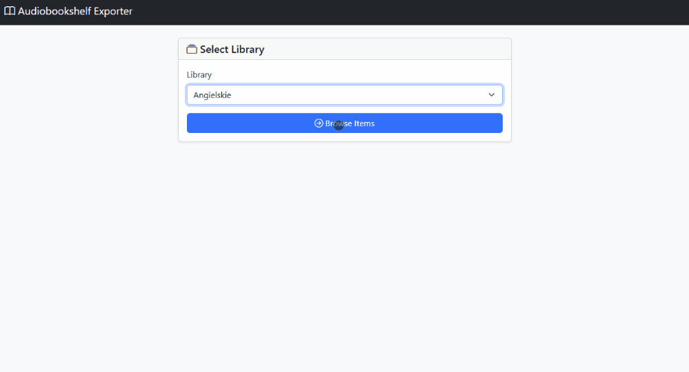

# Audiobookshelf Metadata Exporter

Export `metadata.json` and `cover.jpg` files from your Audiobookshelf library while preserving the original folder structure. The application reads your library from the Audiobookshelf SQLite database and copies the corresponding files from the `.metadata/items` directory to the selected destination.




## Quick Start

```bash
docker compose up -d
```

Then open [http://localhost:8080](http://localhost:8080).

## Docker Compose

```yaml
services:
  audiobookshelf-exporter:
    image: ghcr.io/craftwork2720/audiobookshelf-meta-exporter:latest
    container_name: audiobookshelf-exporter
    ports:
      - "8080:8080"
    environment:
      PORT: 8080
      ABS_DATABASE_PATH: /config/absdatabase.sqlite
      ABS_ITEMS_PATH: /metadata/items
      EXPORT_PATH: /data/exported
    volumes:
      - "/path/to/abs/config:/config:ro"      # ABS config (absdatabase.sqlite)
      - "/path/to/abs/metadata:/metadata:ro"  # ABS metadata (items/)
      - "./data:/data:rw"          # Export + custom matcher.py
    restart: unless-stopped
```

## Environment Variables

| Variable | Default | Description |
|---|---|---|
| `PORT` | `8080` | Web server port |
| `ABS_DATABASE_PATH` | `/config/absdatabase.sqlite` | Path to Audiobookshelf SQLite database |
| `ABS_ITEMS_PATH` | `/metadata/items` | Path to audiobook metadata/items folder |
| `EXPORT_PATH` | `/data/exported` | Default export destination shown in UI |
| `MATCHER_ENABLED` | `false` | Compares title and author from metadata against folder names to flag mismatches. Drop a custom `matcher.py` in `./data/` to override the built-in one (also toggleable in UI) |
| `LIBRARY_EXPORT_PATHS` | | Per-library export paths. Format: `Name:/path,Name2:/path2`. Overrides default export path for matching library names |
| `SECRET_KEY` | random | Flask session key |

## Usage

1. Select a library from the dropdown
2. Browse items — filter, search, and select what to export
3. Set the export path and click **Export**
4. Results show per-item status for `metadata.json` and `cover.jpg`

